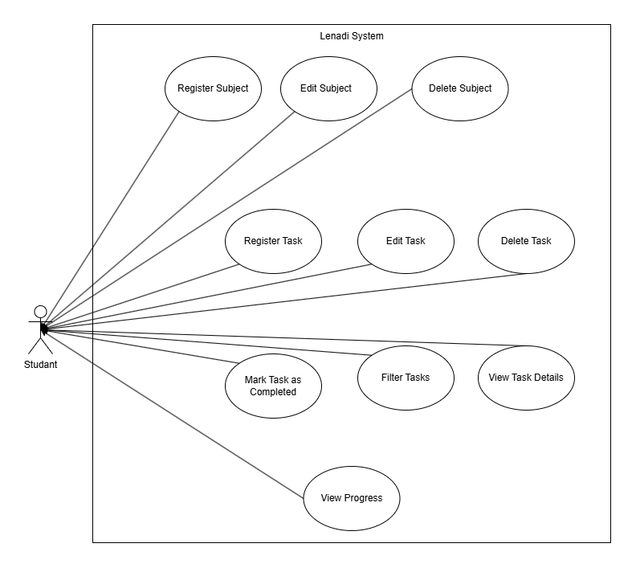

# Project Description

## Overview

Lenadi is a study management system designed to help students organize and manage their academic routine. The system allows users to organize subjects, tasks, and track their academic progress, making it easier to plan activities and monitor their performance throughout the academic term.

## Problem Statement

### Organization

It is common for students to have difficulty organizing materials from different subjects.

### Task Management

Many students miss assignment deadlines or forget to complete academic tasks.

### Planning

Due to difficulties in organizing tasks and academic activities, students often miss deadlines, forget whether they have completed an assignment, or even forget which subject a task belongs to.

### Study Time Management

Many students spend too much time studying a single subject while neglecting others, making it difficult to manage their study time effectively.

## Target Audience

The system was created for students of different educational levels who want to organize their academic routine in a simple and practical way while improving the management of their study time.

## Purpose

Lenadi follows an incremental development approach. Version 1 delivers the essential features for organizing subjects and tasks, including task filtering, completion tracking, progress visualization, and local data persistence.

Version 2 is planned to transform Lenadi into a full-stack application by introducing user authentication, a backend API, and a relational database for persistent and user-specific data.

Later versions may introduce PDF management, study summaries, Lenadi Chat, AI-powered recommendations, flashcards, statistics, and other intelligent study tools.

For more details, see the [project roadmap](06-roadmap.md).

## Use Case Diagram

The following diagram presents the main interactions between the student and the features available in Lenadi Version 1.

